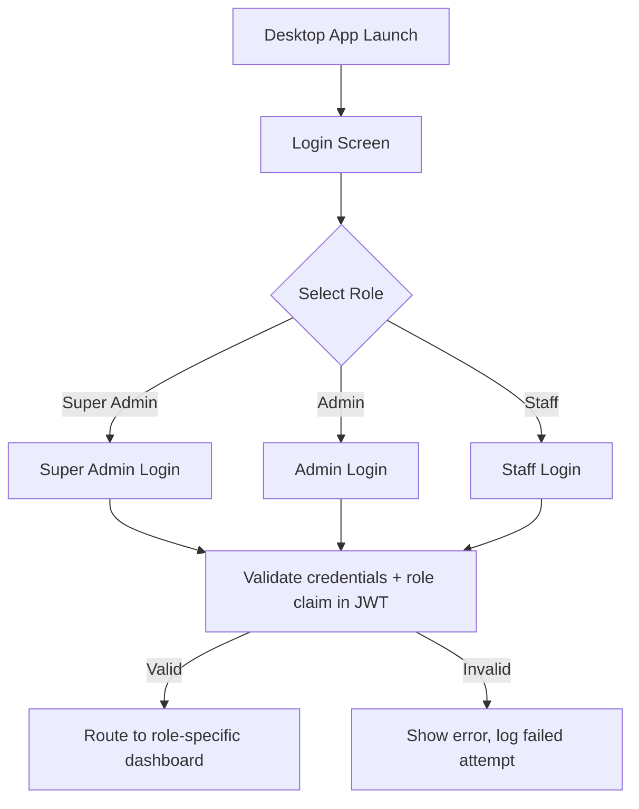
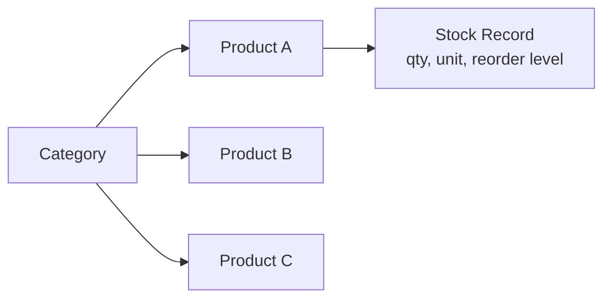
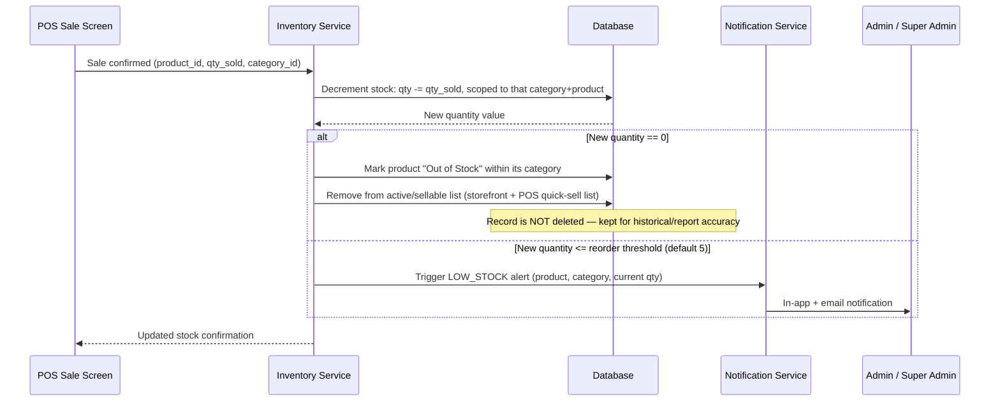

# Usama Book Depot POS — Functional Specification & Role-Based Architecture (v2)

**Purpose of this document:** this is written as an implementation-ready specification. It extends the earlier system architecture document with exact role permissions, inventory behavior, notification rules, and the standard POS functionalities expected of a production-grade system. It is structured so that Claude (or any developer) can generate database schemas, API routes, and UI screens directly from it, section by section, without needing to infer business rules.

---

## 1. Login & Role Selection Flow  

The **Desktop POS login screen** presents a role selector before credential entry:



- The role selected on screen is **not** trusted by itself — the server validates the account's actual role from the database/JWT on login and rejects any mismatch (e.g., a Staff account cannot log in by selecting "Admin"). The selector is a UX convenience, not an access control mechanism.
- **Customers/end users do not use this screen.** They register and log in only through the **Web App**, which has its own signup/login flow (email or phone + password, or OTP).
- Each role, once authenticated, lands on a **different dashboard** — not the same screen with hidden buttons. This keeps the UI simple per role and avoids accidental exposure of controls a role shouldn't see.

---

## 2. Role Permission Matrix

| Capability | Super Admin | Admin | Staff | Customer |
|---|:---:|:---:|:---:|:---:|
| Register new Admin account | ✅ | ❌ | ❌ | — |
| Register new Staff account | ✅ | ❌ | ❌ | — |
| Delete Admin account | ✅ | ❌ | ❌ | — |
| Delete Staff account | ✅ | ❌ | ❌ | — |
| Assign/change roles & permissions | ✅ | ❌ | ❌ | — |
| Add new inventory / products | ✅ | ✅ | ❌ | — |
| Delete inventory / products | ✅ | ✅ | ❌ | — |
| Edit product price / stock | ✅ | ✅ | ❌ | — |
| Record daily sales (checkout) | ✅ | ✅ | ✅ | — |
| View inventory records (read-only) | ✅ | ✅ | ✅ | — |
| View daily sales reports | ✅ | ✅ | ✅ (own shift only) | — |
| View consolidated reports (all categories/branches) | ✅ | ✅ (store-level) | ❌ | — |
| View billing / invoice details | ✅ | ✅ | ❌ | own orders only |
| Configure seasonal promotions | ✅ | ✅ | ❌ | — |
| Receive low-stock alerts (<5 units) | ✅ | ✅ | ❌ | — |
| Receive new-customer-registration notification | ✅ | ✅ | ❌ | — |
| Register / browse / order online | — | — | — | ✅ |
| Track own order status | — | — | — | ✅ |
| View system audit log | ✅ | ❌ | ❌ | — |
| Override / superuser actions | ✅ | ❌ | ❌ | — |

**Design rule:** Staff can *see* inventory and *report discrepancies* (e.g., "10 units missing") but cannot alter inventory records directly — any correction goes through Admin or Super Admin. This matches the requirement that Staff "check inventory records and report to Admin."

---

## 3. Detailed Role Behavior

### 3.1 Super Admin — full system control
- Only role that can create, edit, or delete Admin **and** Staff accounts.
- Only role that can assign/change permissions.
- Full visibility across all product categories, all sales, all branches (future multi-branch ready).
- Can add or delete inventory directly, same as Admin, but also has override authority (e.g., force-close a stuck transaction, reverse a sync conflict).
- Receives **all** system notifications (low stock, new registrations, failed syncs, audit flags).
- Only role with access to the **audit log** (every create/update/delete action across the system, with actor, timestamp, and before/after values).

### 3.2 Admin — operational management
- Manages inventory: add, edit, delete products within their scope.
- Manages daily sales records and billing/invoice details.
- Views sales analytics (daily/weekly/monthly/yearly).
- Configures seasonal promotions.
- Receives low-stock and new-customer-registration notifications.
- **Cannot** create/delete Staff or Admin accounts, and cannot change role permissions — that stays with Super Admin only, per your requirement.

### 3.3 Staff — counter operations
- Records sales transactions at the counter (this is their primary job function).
- Views inventory records (read-only) to check stock before selling or to identify discrepancies.
- Can flag/report inventory issues (e.g., "shelf count doesn't match system") — this creates a report visible to Admin, it does not alter stock directly.
- Sees only their own shift's sales figures, not store-wide totals.
- No access to billing configuration, promotions, or account management.

### 3.4 Customer / End User
- Self-registers via the Web App (this is the "new end-user register" requirement — handled entirely on the customer-facing side, separate from staff/admin accounts).
- Browses categorized products, applies active deals, checks out, pays online, tracks delivery.
- New registration triggers a notification to Admin/Super Admin (useful for tracking growth and flagging suspicious signups).

---

## 4. Inventory Architecture — Category-Based

Inventory is organized as **categories → products → stock records**, not a flat product list. This matches your five product lines and keeps each category's rules independent.



**Categories (from SRS):** Stationery, Grocery, Garment Printing, Printing Services, Sporting Goods. Each category can define its own unit type (piece, ream, kg, meter, job-order) and pricing rule (fixed retail vs. made-to-order/job pricing for printing).

### 4.1 Stock deduction logic (on every completed sale)



**Key rules, stated explicitly so there's no ambiguity during implementation:**
1. Stock is always decremented **within its specific category** — selling a stationery item never touches grocery or garment-printing stock, even if products share a name.
2. **Out-of-stock products are hidden from active sale/order lists but never deleted from the database** — historical sales and reporting must still reference them.
3. **Low-stock threshold defaults to 5 units** and is configurable per category or per product (some categories, like made-to-order printing, may not need a threshold at all).
4. Low-stock and out-of-stock events are **audit-logged** in addition to triggering notifications.

---

## 5. Notification System

A single Notification Service handles all trigger-based alerts, so new alert types can be added later without touching business logic elsewhere.

| Trigger | Recipient(s) | Channel |
|---|---|---|
| Stock quantity ≤ 5 (configurable) | Admin, Super Admin | In-app + email |
| Product reaches 0 stock | Admin, Super Admin | In-app + email |
| New customer registration | Admin, Super Admin | In-app |
| New online order placed | Admin, Staff (on duty) | In-app |
| Order payment failed | Admin | In-app + email |
| Desktop POS sync failure (queued > X hours) | Admin, Super Admin | In-app + email |
| Staff-reported inventory discrepancy | Admin, Super Admin | In-app |

Architecture-wise, this is an **event-driven, observer-style module**: business actions (sale completed, stock updated, user registered) emit events; the Notification Service subscribes to relevant events and decides who to alert and how — the sales/inventory code itself never needs to know who should be notified.

---

## 6. Standard POS Functionalities (industry-standard, beyond what was explicitly listed)

To match what a production POS used worldwide typically includes, the following are recommended additions:

| Feature | Why it matters |
|---|---|
| Barcode / QR scanning at checkout | Speeds up counter sales, reduces manual entry errors |
| Multiple payment methods per sale (cash, card, wallet, split payment) | Real stores rarely take one payment type only |
| Discounts at line-item and cart level | Beyond seasonal promotions — staff-applied manual discounts (with Admin approval threshold) |
| Returns & refunds workflow | Every real POS needs this; must reverse stock (add back to inventory) and reverse the FBR-reported invoice correctly |
| Held / parked transactions | Staff can "park" a sale mid-way (customer steps away) and resume it later without losing the cart |
| Shift open/close (cash drawer reconciliation) | Staff opens shift with starting cash float, closes with expected vs. actual cash count — critical for daily audit |
| End-of-day (Z-report) | Automated summary per shift/day: total sales, tax collected, discounts given, refunds — feeds into the daily analytics already required |
| Customer lookup at counter (optional) | Link in-store sales to a registered customer for order history/loyalty, if the business wants that later |
| Audit trail per user action | Already required for FBR; extend it to cover account/inventory changes, not just financial transactions |
| Receipt reprint | Staff should be able to reprint a receipt for a past transaction without re-entering it |

These are recommendations to round out the system to "how POS is actually used worldwide" — flag any of these you don't want, and they can be excluded from the build scope.

---

## 7. Updated Data Model (additions to the earlier architecture doc)

**MongoDB collections (additions/changes):**

```
users
  - _id, name, email/phone, password_hash, role: ["superadmin","admin","staff","customer"],
    created_by, is_active, created_at

categories
  - _id, name, unit_type, default_reorder_threshold

products
  - _id, category_id, name, sku/barcode, price, unit, stock_qty,
    reorder_threshold, is_active, is_job_order (bool), created_at, updated_at

stock_movements
  - _id, product_id, category_id, change_qty, reason: ["sale","restock","adjustment","return"],
    performed_by (user_id), source: ["desktop","web"], timestamp

transactions
  - _id, items[{product_id, qty, price}], total, tax_amount, payment_method,
    staff_id, shift_id, fbr_invoice_no, fbr_qr_data, status, created_at

notifications
  - _id, type, recipient_roles[], payload, is_read, created_at

audit_logs
  - _id, actor_id, actor_role, action, target_type, target_id,
    before_value, after_value, timestamp

shifts
  - _id, staff_id, opening_cash, closing_cash_expected, closing_cash_actual,
    opened_at, closed_at
```

---

## 8. API Endpoint Map (role-guarded)

```
POST   /auth/login                         (all roles, role validated server-side)
POST   /auth/register-staff                (superadmin only)
POST   /auth/register-admin                (superadmin only)
DELETE /auth/users/:id                     (superadmin only)
PATCH  /auth/users/:id/role                (superadmin only)

GET    /categories                         (superadmin, admin, staff)
POST   /categories                         (superadmin, admin)

GET    /products                           (all roles incl. customer, storefront-scoped)
POST   /products                           (superadmin, admin)
PATCH  /products/:id                       (superadmin, admin)
DELETE /products/:id                       (superadmin, admin)

POST   /transactions                       (superadmin, admin, staff)
GET    /transactions/shift/:shiftId        (staff — own shift only)
GET    /transactions/reports/daily         (superadmin, admin)
GET    /transactions/reports/weekly        (superadmin, admin)
GET    /transactions/reports/monthly       (superadmin, admin)
GET    /transactions/reports/yearly        (superadmin, admin)

POST   /shifts/open                        (staff)
POST   /shifts/close                       (staff)

GET    /notifications                      (superadmin, admin)
GET    /audit-logs                         (superadmin only)

POST   /orders                             (customer)
GET    /orders/:id/status                  (customer — own orders only)
POST   /promotions                         (superadmin, admin)
```

---

## 9. Implementation Notes for Build

- **RBAC enforcement point:** a single Express middleware reads the `role` claim from the verified JWT and checks it against an allow-list per route (as mapped in Section 8) — do this centrally, not per-controller, so permission rules stay in one place and match Section 2's matrix exactly.
- **Notification Service as its own module:** implement as an event emitter (`stockService.emit('low_stock', {...})`) with the Notification Service subscribing — keeps inventory/sales logic decoupled from "who gets told."
- **Category scoping:** every stock-changing operation must include `category_id` alongside `product_id` — never decrement stock by product name/SKU alone, to avoid cross-category collisions.
- **Out-of-stock ≠ deleted:** implement as `is_active: false` + `stock_qty: 0`, filtered out of customer/POS-facing product lists, but still queryable for reports and audit.
- **This document builds on** the previously generated system architecture (client/edge/gateway/service/data layers, offline-sync design) — implement role/permission logic inside the existing "Identity & Access" and "Catalog & Inventory" service modules rather than as new top-level components.
